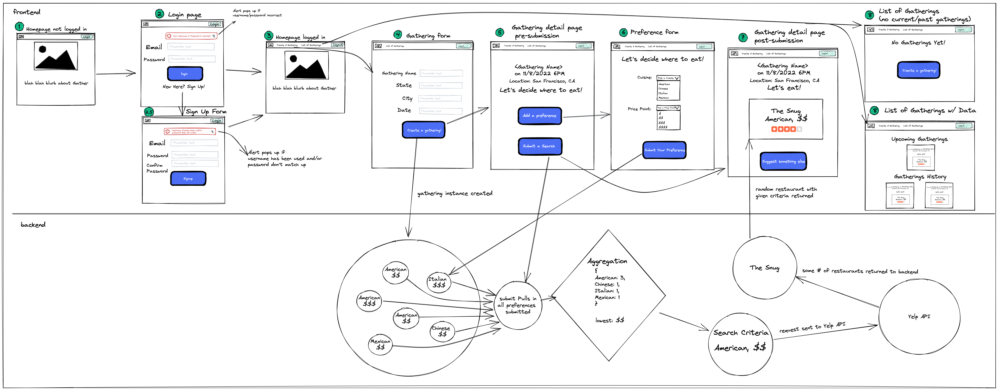

# Diagram & User Story

The application was designed with two microservices: accounts and gatherings. Below is a wireframe diagram that further details the relationships between these services with the frontend. The backend of the application was developed with a FastAPI framework and Python. The frontend of the application was developed with React.

 

## User Story
Correlating to the wireframe above, the user story of navigating Gather is as follows:
### Homepage - for logged out user (Wireframe No. 1)
- The user comes to the homepage that has info about the site and an option to login through the button on the navbar at top of page.
- GHI Directory: refer to MainPage.js

### Login & Signup (Wireframe No. 2 & 2.5)
- Login page for users to sign in with their email and password, or click the sign
up button if they do not have an account yet.
- If the user does not have an account, they will go to the sign up form, enter their email, and create a password.
- GHI Directory: refer to LoginForm.js and SignupForm.js

### Homepage - for logged in user (Wireframe No. 3)
- Once the user logs in, they are redirected to the homepage that will now have an updated navbar with additional features that will navigate users to create a gathering, list of their gatherings, and logout button.

### Gathering Form (Wireframe No. 4)
- The user will enter the gathering name, date for their gathering and the desired
location (select state and city), and then click "create a gathering button".
- GHI Directory: refer to GatheringForm.js

### Gathering Detail: Pre-Submission (Wireframe No. 5)
- Upon successful submission of the gathering form, the user will be routed to the gathering detail page. The detail page will have a preference and submit search button.
- Friends of the user can click, "add a preference" button until all preferences are added. Once all preferences are entered, the user will click the submit search button.
- GHI Directory: refer to GatheringDetail.js

### Preference Form (Wireframe No. 6)
- When the user clicks, "add a preference" on the gathering pre-submission page, it will navigate the user to the preference form with two drop downs. The user will select the cuisine type and their desired price point. Once their selection is complete, they click, "submit your preference." On a successful submission, the page
will navigate back to the gathering detail page for the next preference to be entered.
- GHI Directory: refer to PreferenceForm.js

### Gathering Detail: Post-Submission (Wireframe No. 7)
- If the user has clicked submit a search, they will be routed to the event page post-submission that will show the name of the gathering, date and time, the search result, and a button to generate a new result if they are not satisfied with the current result.

### List of Gatherings (Wireframe No. 8)
- Once the user has created their first gathering, they will be able to see it populate on a gathering list page. The list page will show both upcoming and past gatherings. If the
user has not created any gatherings, the list view will have a button to route back to the gathering creation form.
- GHI Directory: refer to GatheringList.js
